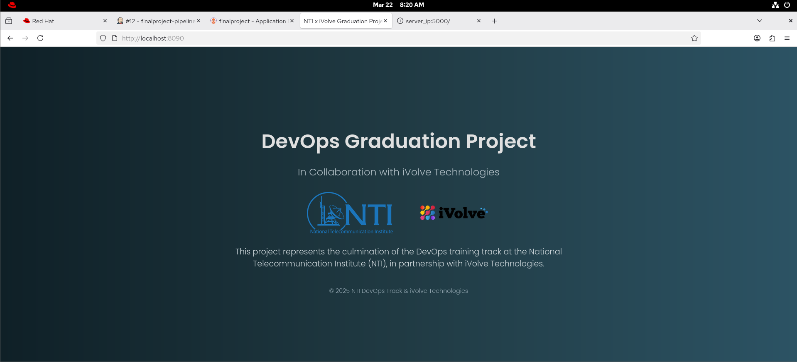
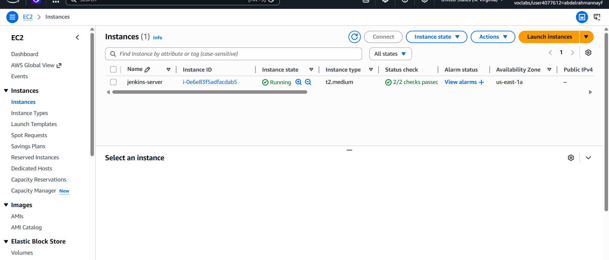
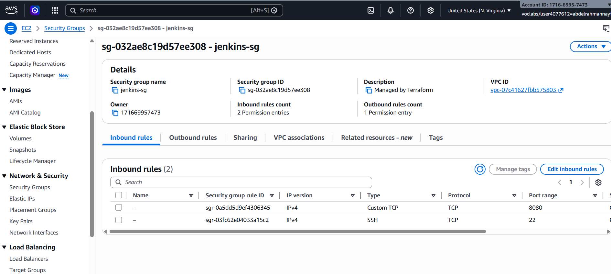
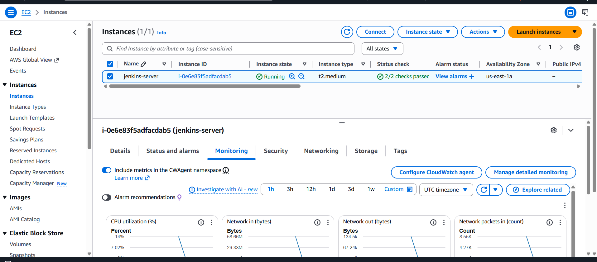
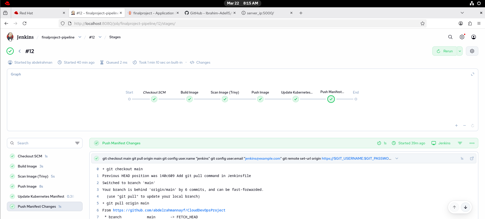
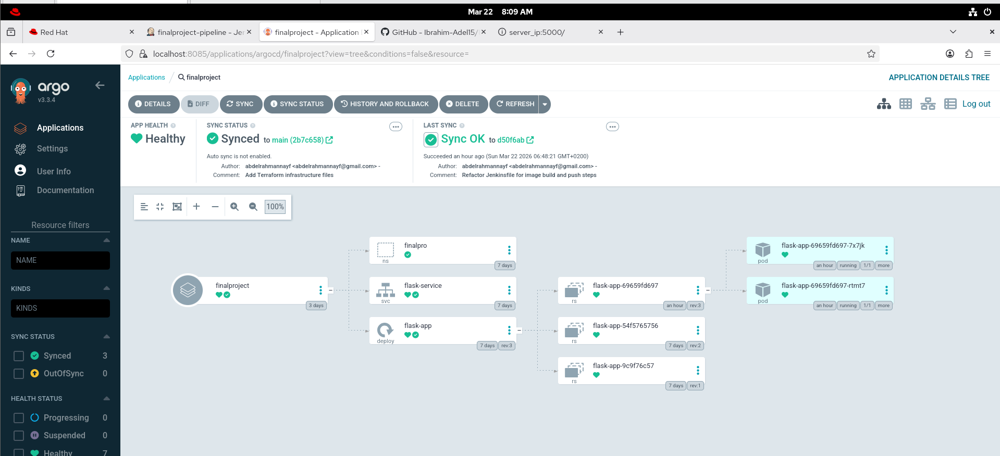
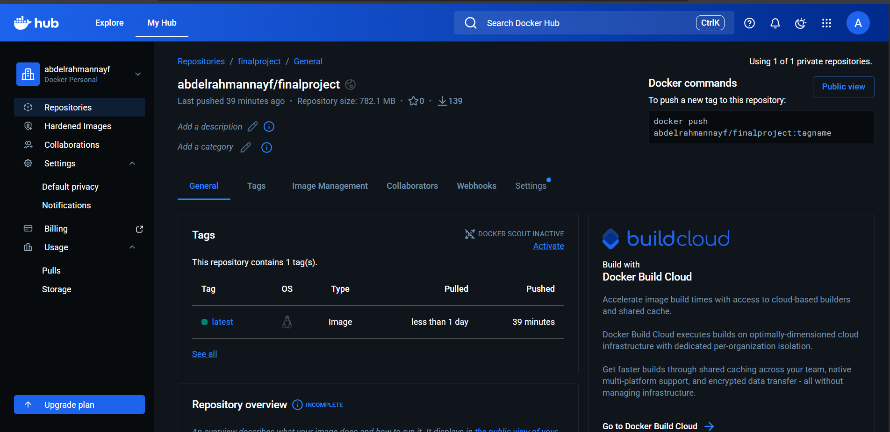

# ☁️ CloudDevOps Project

A complete end-to-end DevOps pipeline for a Flask web application — covering containerization, CI/CD, GitOps deployment, infrastructure provisioning, and configuration management.

---

## 🏗️ Architecture


---

## 🛠️ Tech Stack

| Category              | Tool                     |
|-----------------------|--------------------------|
| Source Control        | GitHub                   |
| Containerization      | Docker                   |
| Container Registry    | DockerHub                |
| Orchestration         | Kubernetes (Kind)        |
| Infrastructure (IaC)  | Terraform + AWS          |
| Config Management     | Ansible                  |
| CI Pipeline           | Jenkins + Shared Library |
| CD / GitOps           | ArgoCD                   |
| Security Scanning     | Trivy                    |
| Monitoring            | AWS CloudWatch           |

---

## 📁 Project Structure

```
CloudDevOpsProject/
├── source/                      # Flask Application
│   ├── app.py
│   ├── requirements.txt
│   ├── Dockerfile
│   ├── templates/
│   └── static/
│
├── kubernetes/                  # K8s Manifests
│   ├── namespace.yaml
│   ├── deployment.yaml
│   └── service.yaml
│
├── terraform/                   # AWS Infrastructure
│   ├── provider.tf
│   ├── main.tf
│   └── modules/
│       ├── network/
│       │   ├── main.tf
│       │   └── outputs.tf
│       └── server/
│           ├── main.tf
│           ├── variables.tf
│           └── outputs.tf
│
├── ansible/                     # Configuration Management
│   ├── inventory
│   ├── playbook.yml
│   └── roles/
│       └── jenkins/
│           └── tasks/main.yml
│
├── vars/                        # Jenkins Shared Library
│   ├── buildImage.groovy
│   └── pushImage.groovy
│
├── Jenkinsfile                  # CI Pipeline Definition
├── argocd.yaml                  # ArgoCD Application Manifest
└── README.md
```

---

## 🚀 Setup & Deployment

### Prerequisites

- Docker
- Kubernetes cluster (Kind or Minikube)
- Jenkins
- ArgoCD installed on cluster
- AWS CLI configured
- Terraform >= 1.0
- Ansible

---

### 1️⃣ Clone Repository

```bash
git clone https://github.com/abdelrahmannayf/CloudDevOpsProject.git
cd CloudDevOpsProject
```

---

### 2️⃣ Build & Push Docker Image

```bash
docker build -t abdelrahmannayf/finalproject:latest ./source
docker login
docker push abdelrahmannayf/finalproject:latest
```

---

### 3️⃣ Provision AWS Infrastructure

```bash
# Create S3 bucket for Terraform state
aws s3 mb s3://clouddevops-tf-state-abdo --region us-east-1

cd terraform
terraform init
terraform plan
terraform apply -auto-approve
```

**Resources created:**

| Resource         | Name                       |
|------------------|----------------------------|
| VPC              | devops-vpc                 |
| Public Subnet    | devops-public-subnet       |
| Internet Gateway | devops-igw                 |
| Network ACL      | devops-nacl                |
| EC2 Instance     | jenkins-server (t2.medium) |
| Security Group   | jenkins-sg (ports 22, 8080)|
| CloudWatch Alarm | jenkins-cpu-alarm          |
| S3 Backend       | clouddevops-tf-state-abdo  |

---




### 4️⃣ Configure Servers with Ansible

```bash
cd ansible
ansible-playbook -i inventory playbook.yml --ask-become-pass
```

**Installs on managed node:** Java, Git, Docker, Jenkins

---

### 5️⃣ Deploy to Kubernetes

```bash
kubectl apply -f kubernetes/namespace.yaml
kubectl apply -f kubernetes/deployment.yaml
kubectl apply -f kubernetes/service.yaml

# Verify
kubectl get pods -n finalpro
kubectl get svc -n finalpro
```

---

### 6️⃣ Configure Jenkins

1. Open Jenkins: `http://SERVER_IP:8080`
2. Add credentials:
   - `dockerhub-cred` → DockerHub username/password
   - `github-cred` → GitHub username/token
3. Go to **Manage Jenkins → System → Global Pipeline Libraries**:
   - Name: `shared-library`
   - Default version: `main`
   - Repository: `https://github.com/abdelrahmannayf/CloudDevOpsProject.git`
4. Create a new **Pipeline** job pointing to this repository

---

### 7️⃣ Setup ArgoCD

```bash
# Install ArgoCD
kubectl create namespace argocd
kubectl apply -n argocd -f https://raw.githubusercontent.com/argoproj/argo-cd/stable/manifests/install.yaml

# Get admin password
kubectl -n argocd get secret argocd-initial-admin-secret \
  -o jsonpath="{.data.password}" | base64 -d

# Apply application manifest
kubectl apply -f argocd.yaml

# Access UI via port-forward
kubectl port-forward svc/argocd-server -n argocd 8085:443
```

Open: `https://localhost:8085`

---

## 🔄 CI/CD Pipeline Flow

```
1. Developer pushes code to GitHub
         ↓
2. Jenkins detects change → starts pipeline
         ↓
3. Build Docker image from ./source
         ↓
4. Trivy scans image for vulnerabilities
         ↓
5. Push image to DockerHub
         ↓
6. Update kubernetes/deployment.yaml with new image
         ↓
7. Push updated manifest to GitHub
         ↓
8. ArgoCD detects manifest change
         ↓
9. ArgoCD deploys new version to Kubernetes
         ↓
10. Application live ✅
```

---

## 📦 Jenkins Shared Library

Located in `vars/`, reusable across pipelines:

```groovy
// vars/buildImage.groovy
def call(String imageName) {
    sh "docker build -t ${imageName}:latest ./source"
}
```

```groovy
// vars/pushImage.groovy
def call(String imageName) {
    withCredentials([usernamePassword(credentialsId: 'dockerhub-cred',
        passwordVariable: 'DOCKER_PASS', usernameVariable: 'DOCKER_USER')]) {
        sh 'docker login -u $DOCKER_USER -p $DOCKER_PASS'
        sh "docker push ${imageName}:latest"
    }
}
```

Usage in `Jenkinsfile`:

```groovy
@Library('shared-library') _
buildImage('abdelrahmannayf/finalproject')
pushImage('abdelrahmannayf/finalproject')
```

---

## 🌐 Access the Application

```bash
# Get service info
kubectl get svc -n finalpro

# Access via browser or curl
curl http://NODE_IP:30007
```

---

## 📊 Monitoring

CloudWatch alarm configured on the Jenkins EC2:

| Setting            | Value             |
|--------------------|-------------------|
| Metric             | CPUUtilization    |
| Threshold          | > 80%             |
| Evaluation Periods | 2                 |
| Period             | 120 seconds       |
| Alarm Name         | jenkins-cpu-alarm |

---

## 🔐 Required Credentials

| ID               | Type              | Used In          |
|------------------|-------------------|------------------|
| `dockerhub-cred` | Username/Password | Jenkins Pipeline |
| `github-cred`    | Username/Token    | Jenkins Pipeline |

---

## 👤 Author

**Abdelrahman Nayf**

- 🐙 GitHub: [@abdelrahmannayf](https://github.com/abdelrahmannayf)
- 📦 DockerHub: [abdelrahmannayf](https://hub.docker.com/u/abdelrahmannayf)
- 🔗 Project Repo: [CloudDevOpsProject](https://github.com/abdelrahmannayf/CloudDevOpsProject)
